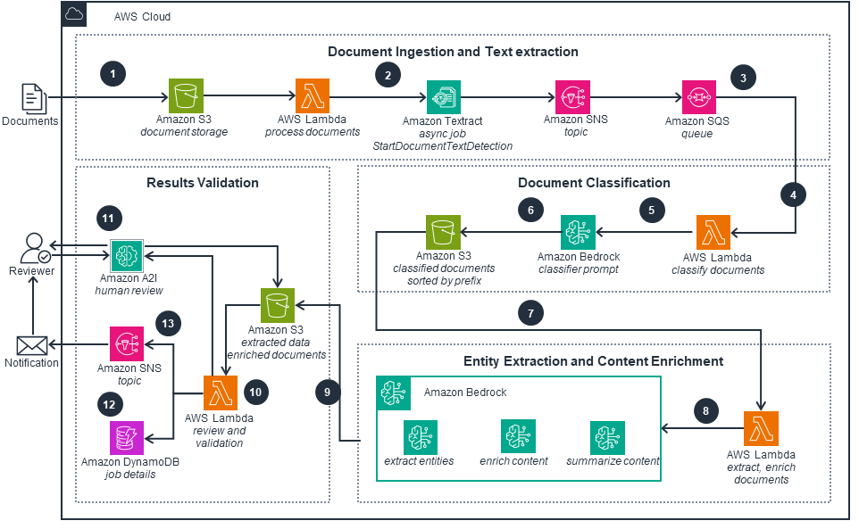

# Intelligent Document Processing with AWS

## Overview

This architecture is based on the solution provided by the [AWS Solutions Library](https://aws.amazon.com/solutions/guidance/intelligent-document-processing-on-aws/). This configuration demonstrates how to accelerate business process and reduce overall costs associated with an organisation's document workflow using an Intelligent Document Processing (IDP) solution that is backed by AWS AI/ML services.

### Architecture

#### Document Ingestion and Text Extraction

- Documents are uploaded to Amazon S3 which invokes an AWS Lambda function.
- The Lambda function starts an Amazon Textract asynchronous detection job.
- Amazon Textract sends a completion notification to Amazon SNS. The Amazon SNS topic sends the completion message to the Amazon SQS queue.

#### Document Classification

- A Lambda function is invoked by the Amazon SQS queue to process and read the Amazon Textract output.
- The Lambda function calls Amazon Bedrock with a classification prompt containing the document text and instructions on how to classify the document.
- The Lambda function saves raw OCR text along with the result of the classification prompt to Amazon S3. 
- The Amazon S3 bucket with the classified document invokes a Lambda function to process the document content according to the classification.

#### Entity Extraction and Content Enrichment

- The Lambda function calls Amazon Bedrock with enrichment prompts containing the document text and instructions on how to enrich the content and normalize the content.
- The data from Amazon Bedrock and any enriched documents are saved in an Amazon S3 bucket location.

#### Results Validation

- A Lambda function is invoked from the Amazon S3 bucket. The function runs review and validation on the data using predefined rules. It also checks accuracy scores and sends the information for human review if threshold scores are not met
- A human completes the review and uses Amazon A2I to update the appropriate information in to the Amazon S3 location, which initiates another validation using the Lambda function.
- A Lambda function stores the extracted and verified data in an Amazon DynamoDB table.
- Lambda sends a notification that all rules were verified correctly or if any information needs further human review

### IDP Workflow

---

| Name | Version |
|------|---------|
|  [aws](#requirement\_aws) | 5.81.0 |
|  [random](#requirement\_random) | 3.6.3 |

## Providers

| Name | Version |
|------|---------|
|  [aws](#provider\_aws) | 5.81.0 |
|  [random](#provider\_random) | 3.6.3 |

## Modules

| Name | Source | Version |
|------|--------|---------|
|  [textract\_updates\_lambda\_function](#module\_textract\_updates\_lambda\_function) | ./modules/lambda-function-builder | n/a |
|  [textract\_updates\_queues\_and\_notifications](#module\_textract\_updates\_queues\_and\_notifications) | ./modules/textract-updates | n/a |

## Resources

| Name | Type |
|------|------|
| [aws_s3_bucket.classified_documents](https://registry.terraform.io/providers/hashicorp/aws/5.81.0/docs/resources/s3_bucket) | resource |
| [aws_s3_bucket.enriched_documents](https://registry.terraform.io/providers/hashicorp/aws/5.81.0/docs/resources/s3_bucket) | resource |
| [aws_s3_bucket.input_documents](https://registry.terraform.io/providers/hashicorp/aws/5.81.0/docs/resources/s3_bucket) | resource |
| [aws_s3_bucket_acl.classified_documents](https://registry.terraform.io/providers/hashicorp/aws/5.81.0/docs/resources/s3_bucket_acl) | resource |
| [aws_s3_bucket_acl.enriched_documents](https://registry.terraform.io/providers/hashicorp/aws/5.81.0/docs/resources/s3_bucket_acl) | resource |
| [aws_s3_bucket_acl.input_documents](https://registry.terraform.io/providers/hashicorp/aws/5.81.0/docs/resources/s3_bucket_acl) | resource |
| [random_string.this](https://registry.terraform.io/providers/hashicorp/random/3.6.3/docs/resources/string) | resource |
| [aws_iam_policy_document.allow_lambda_textract_async_job](https://registry.terraform.io/providers/hashicorp/aws/5.81.0/docs/data-sources/iam_policy_document) | data source |

## Inputs

| Name | Description | Type | Default | Required |
|------|-------------|------|---------|:--------:|
|  [domain\_name](#input\_domain\_name) | The domain name of the Sagemaker studio instance | `string` | `"IDPSagemakerDomain"` | no |
|  [user\_profile\_name](#input\_user\_profile\_name) | The user profile name for the IDP workshop | `string` | `"SageMakerUser"` | no |

## Outputs

No outputs.
